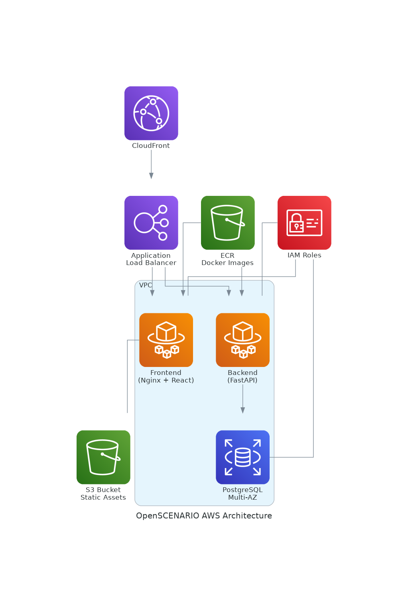

[](LICENSE)
[](https://www.asam.net/standards/detail/openscenario/)
[](docs/aws_troubleshooting.md)
[]()

A web-based tool for validating OpenSCENARIO (.xosc) files with a user-friendly interface. Deployed on AWS ECS with high availability and scalability.

## Table of Contents

- [Features](#features)
- [Screenshots](#screenshots)
- [Quick Start](#quick-start)
  - [Prerequisites](#prerequisites)
  - [Using Docker (Recommended)](#using-docker-recommended)
  - [Local Development](#local-development)
- [Project Structure](#project-structure)
- [API Documentation](#api-documentation)
- [Deployment](#deployment)
- [Contributing](#contributing)
- [License](#license)

## Features

- **File Upload & Validation**
  - Drag and drop interface for uploading OpenSCENARIO files
  - Real-time validation feedback
  - Detailed error and warning messages

- **User Interface**
  - Responsive design for desktop and mobile
  - Dark/light mode support
  - Intuitive result visualization

- **Integration**
  - RESTful API for programmatic access
  - Containerized deployment with Docker
  - CI/CD ready
  - AWS ECS deployment with high availability

## Deployment Status

The application is currently deployed on AWS ECS with the following status:

- **Frontend Service**: Running healthy tasks with Nginx serving static files
- **Backend Service**: Running healthy tasks with FastAPI providing API endpoints
- **Load Balancer**: Application Load Balancer routing traffic to both services
- **Database**: PostgreSQL RDS instance with multi-AZ deployment

## Quick Start

### Prerequisites

- Docker 20.10+ and Docker Compose 1.29+
- Node.js 16+ and npm 8+ (for development)
- Python 3.8+ (for backend development)
- OpenSCENARIO validator executable

### Using Docker (Recommended)

```bash
# Clone the repository
git clone <repository-url>
cd DS_DevOps_project

# Start the application
docker-compose -f docker-compose.prod.yml up -d --build
```

> **Note on Validator Integration**
> 
> The OpenSCENARIO validator is now included in the Docker image by default. 
> The validator executable and its required libraries are automatically copied during the build process.

The production application will be available at:
- Frontend: http://localhost:8081
- Backend API: http://localhost:8080
- API Documentation: http://localhost:8080/docs

> **Note**: In production, the frontend is served on port 8081 to avoid conflicts with other services. In development, the frontend runs on port 3000.

### Local Development

#### Using Docker Compose (Recommended)

```bash
# Start development environment
docker-compose -f docker-compose.dev.yml up -d --build

# View logs
docker-compose -f docker-compose.dev.yml logs -f

# Stop services
docker-compose -f docker-compose.dev.yml down
```

Development URLs (when using Docker Compose):
- Frontend: http://localhost:3000 (development server with hot-reload)
- Backend API: http://localhost:8080
- API Documentation: http://localhost:8080/docs

> **Note**: The frontend development server runs on port 3000 by default. The backend API is always on port 8080.

#### Manual Setup

##### Backend

```bash
cd app/backend/openscenario-api-service

# Create and activate virtual environment
python -m venv venv
source venv/bin/activate  # Linux/macOS
# venv\Scripts\activate  # Windows

# Install dependencies
pip install -r requirements.txt
pip install -r requirements-dev.txt

# Set environment variables
export VALIDATOR_PATH=./validator/OpenSCENARIOValidator
export LD_LIBRARY_PATH=$LD_LIBRARY_PATH:$(dirname $VALIDATOR_PATH)

# Start the development server
uvicorn main:app --reload --host 0.0.0.0 --port 8080
```

##### Frontend

```bash
cd app/frontend/scenario-tool-suite

# Install dependencies
npm install

# Start the development server
npm run dev
```

The frontend development server will be available at http://localhost:3000

## Project Structure

```
.
├── app/
│   ├── backend/
│   │   └── openscenario-api-service/
│   └── frontend/
│       └── scenario-tool-suite/
│           ├── src/
│           ├── public/
│           └── package.json
├── ansible/
├── docker/
│   ├── nginx/
│   └── openscenario-validator/
├── docs/
├── terraform/                 # Infrastructure as code
├── docker-compose.dev.yml
├── docker-compose.prod.yml
├── Dockerfile
└── README.md
```

## AWS Architecture Diagram

The AWS architecture diagram can be generated automatically using **CloudSkiff’s Diagrams (formerly Terraformer)** combined with **Diagrams.net**:

1. **Terraformer** extracts resource information from Terraform state or code and outputs a graphical structure in JSON.
2. **Diagrams.net** imports this JSON to render an accurate AWS architecture diagram that stays up-to-date with your infrastructure.

Refer to the `docs` folder for instructions on running the toolchain.

## AWS Architecture

Below is the current AWS architecture for the OpenSCENARIO deployment:



### Components:

- **CloudFront**: CDN for global content delivery
- **Application Load Balancer**: Routes traffic to frontend and backend services
- **Frontend Service**: Containerized React application with Nginx
- **Backend Service**: FastAPI service handling API requests
- **RDS PostgreSQL**: Multi-AZ database for persistent storage
- **S3 Bucket**: Stores static assets and user uploads
- **ECR**: Docker image repository for container images
- **IAM**: Security roles and permissions

### Network Flow:
1. Users access the application via CloudFront
2. Requests are routed through the ALB
3. ALB forwards requests to the appropriate ECS services
4. Backend service communicates with RDS for data persistence

## API Documentation

### Validate OpenSCENARIO File

- **URL**: `/api/validate`
- **Method**: `POST`
- **Content-Type**: `multipart/form-data`
- **Request Body**:
  - `file`: The OpenSCENARIO file to validate
- **Response**:
  ```json
  {
    "valid": true,
    "messages": [
      {
        "level": "ERROR",
        "message": "Error message",
        "line": 42,
        "column": 10
      }
    ]
  }
  ```

### Health Check

- **URL**: `/health`
- **Method**: `GET`
- **Response**:
  ```json
  {
    "status": "ok"
  }
  ```

For more details, visit the interactive API documentation at `/docs` when the backend is running.

## Deployment

### Production Deployment

1. **Using Docker Compose**

   ```bash
   docker-compose -f docker-compose.prod.yml up -d --build
   ```

2. **Kubernetes**

   See [deployment guide](docs/deployment.md#kubernetes-deployment) for Kubernetes deployment instructions.

3. **AWS ECS (Elastic Container Service)**

   The application can be deployed to AWS ECS with Fargate for serverless container management:
   
   - Frontend and backend services are containerized and deployed as ECS tasks
   - Application Load Balancer (ALB) routes traffic to the services
   - Docker images are stored in Amazon ECR
   - Service-to-service communication via ALB DNS names
   
   **Recent Updates:**
   - Fixed Nginx upstream configuration to use ALB DNS for backend communication
   - Implemented proper container health checks
   - Optimized Docker images for faster startup and smaller size
   
   For detailed AWS deployment instructions and troubleshooting, see the [AWS Deployment Guide](docs/aws_troubleshooting.md).

### Environment Variables

#### Backend

| Variable | Default | Description |
|-----------------|----------------|-------------------|
| `VALIDATOR_PATH` | - | Path to OpenSCENARIO validator executable |
| `LD_LIBRARY_PATH` | - | Library path for shared libraries |
| `PORT` | `8080` | Port to run the backend service |
| `LOG_LEVEL` | `INFO` | Logging level |
| `MAX_UPLOAD_SIZE` | `10485760` | Maximum upload file size in bytes |

#### Frontend

| Variable | Default | Description |
|-----------------|----------------|-------------------|
| `VITE_API_URL` | `http://localhost:8080` | Backend API URL |

## Contributing

We welcome contributions! Please read our [Contributing Guide](CONTRIBUTING.md) to learn how you can contribute to this project.

## License

This project is licensed under the MIT License - see the [LICENSE](LICENSE) file for details.
